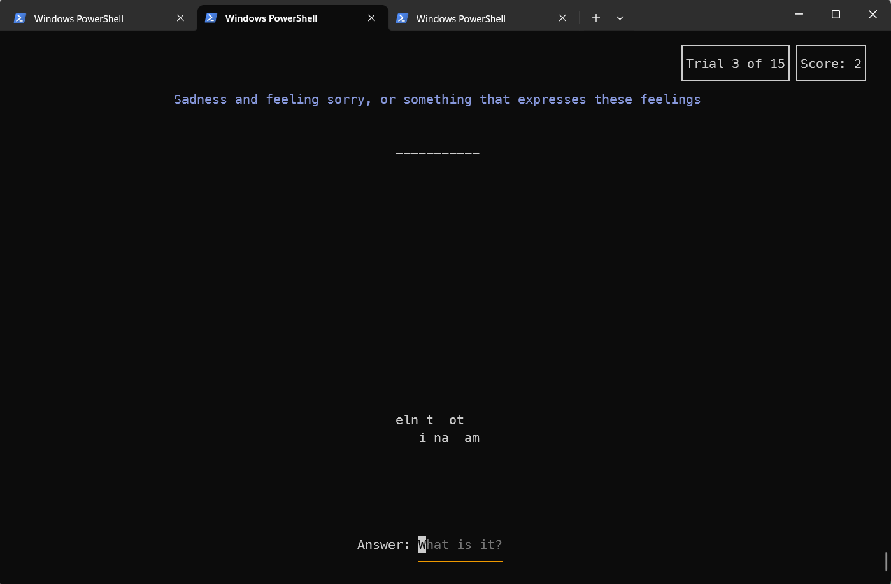

# what-is-word-cli [![NPM version][npm-image]][npm-url]

> CLI game where your task is to unscramble words by given definition

## Install

```bash
$ npm install --global what-is-word-cli
```

## CLI

```
$ what-is-word-cli --help

  Usage
    $ what-is-word-cli

  Options
    --category Category to be used in the game's round
    --topic Topic to be used in the game's round (some categories have topics others don't have)
    --subtopic Subtopic to be used (when using the topic option)
    --name The name for a category (for a topic)

  Examples
    $ what-is-word-cli
    $ what-is-word-cli --category fruits
    $ what-is-word-cli -c fruits
    $ what-is-word-cli --category sports
    $ what-is-word-cli --topic literature
    $ what-is-word-cli --topic literature --subtopic mark-twain
    $ what-is-word-cli --topic literature --subtopic mark-twain --name is-he-living-or-is-he-dead
    $ what-is-word-cli -t literature -s mark-twain -n is-he-living-or-is-he-dead
```

## Demo


## Screenshots



## License

MIT © [Rushan Alyautdinov](https://github.com/akgondber)

[npm-image]: https://img.shields.io/npm/v/what-is-word-cli.svg?style=flat
[npm-url]: https://npmjs.org/package/what-is-word-cli
